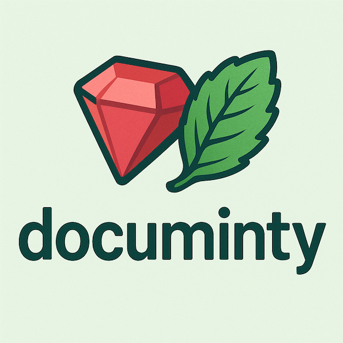

# Documinty



**Documinty** (alias `dty`) is a lightweight CLI tool to help you document your Ruby codebase as you build features. It lets you:

- Create and manage **features**
- Tag files with a **node type**, **description**, and **methods**
- Query documentation by file or by feature
- Visualize which files belong to a feature (grouped by directory)
- Search for features by substring

Everything you record lives under a `.documinty/` folder in your project. You can version it alongside your code, making documentation part of your workflow.


## Installation

### Prerequisites

- Ruby ≥ 3.1
- Bundler (optional, but recommended)

### From RubyGems

```bash
gem install documinty
# or, if you prefer the short alias:
# gem install dty

```

### From Git(development version)

```
git clone git@github.com:yourusername/documinty.git
cd documinty
```

Build and install locally
```
bundle install
bundle exec rake build
gem install pkg/documinty-<VERSION>.gem
```

## Usage


### 1. Go into your existing codebase
```
cd path/to/your-app
```

### 2. Initialize Documinty (creates .documinty/)
```
dty init --codebase your-app
```
### 3. Create a feature called "user-auth"
```
dty feat user-auth
```
### 4. Tag a file under "user-auth" as a controller, prompt for description & methods
```
dty doc app/controllers/sessions_controller.rb -f user-auth -n controller

#   • You’ll be prompted:
#     Enter a brief description for this node⚙️:
#     (e.g.) "Handles login/logout flows"
#
#     Enter comma-separated methods for this node🛠️:
#     (e.g.) :new, :create, :destroy
```
### 5. View documentation for that file
```
dty show app/controllers/sessions_controller.rb
```
### 6. List all defined features
```
dty features
```
### 7. Show all files under "user-auth"
```
dty list_f user-auth
```
### 8. Show file structure under "user-auth"
```
dty involved_f user-auth
```
### 9. Search for features that contain "user"
```
dty search_f user
```

### Project layout
```
.
├── exe/
│   ├── documinty      # primary executable stub
│   └── dty            # short alias stub
├── lib/
│   └── documinty/
│       ├── cli.rb     # Thor CLI definitions
│       └── store.rb   # YAML-backed storage logic
│   └── documinty.rb   # loads version and CLI
│   └── documinty/version.rb
├── .documinty/        # created once you run `dty init`
│   ├── config.yml
│   └── features/      # per-feature YAML files live here
├── Rakefile           # builds the gem
├── documinty.gemspec  # gemspec (metadata + dependencies)
├── LICENSE.txt
└── README.md
```

### Contributing
1 - Fork the repository

2 - Create a new branch (git checkout -b my-feature)

3 - Make your changes and add tests if applicable

4 - Commit, push, and open a Pull Request

5 - We’ll review and merge!

### License
License
This project is licensed under the MIT License.
See LICENSE.txt for details.